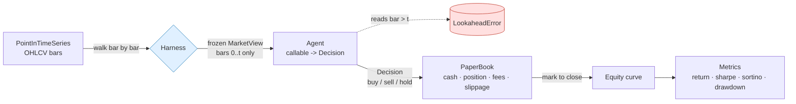

<div align="center">


# bar-by-bar

**Framework-agnostic agentic backtesting harness — feed any agent point-in-time bars, with a hard look-ahead guard.**

_Built and maintained by **Viprasol Tech**._

[](https://github.com/Viprasol-Tech/bar-by-bar/actions/workflows/ci.yml)
[](LICENSE)
[](https://www.python.org/)
[](http://mypy-lang.org/)
[](tests/)
[](https://t.me/viprasol_help)

</div>

---

`bar-by-bar` is a tiny, dependency-light backtesting harness that lets **any agent or strategy** make trading decisions **one bar at a time** on strictly **point-in-time data**. Its defining feature is a **hard look-ahead guard**: the agent is handed a *frozen, read-only* window of the market that exposes only the bars up to and including the current one. Any attempt to peek at a future bar raises `LookaheadError` — look-ahead bias becomes a crash, not a silently inflated Sharpe ratio.

It is **framework-agnostic** by design. An "agent" is just a callable `(MarketView) -> Decision`. That covers a plain Python function, a class, or a thin adapter around a **CrewAI / LangGraph / AutoGen** crew or a raw LLM call. Agent frameworks are great at reasoning but have **no notion of point-in-time market replay** — `bar-by-bar` is the missing harness that lets you backtest them honestly.

Everything runs **fully offline**: no network, no API keys. Anything that would need an LLM is a pluggable callable with a built-in deterministic fake, so you can clone and see real metrics in seconds.

> **Educational use only — not financial advice.** Synthetic data and paper fills are for research and testing. Past (or simulated) performance does not predict future results.

## Demo

Run a built-in example agent over deterministic synthetic bars and get a metrics board straight in the terminal. This is **real, pasted output**:

```text
$ python -m bar_by_bar run --agent momentum

Agent: momentum   Bars: 250
bar-by-bar :: momentum agent
+---------------------------+
| Metric        |     Value |
|---------------+-----------|
| Starting cash | 10,000.00 |
| Final equity  | 15,530.60 |
| Total return  |   +55.31% |
| Sharpe        |      3.05 |
| Sortino       |      5.29 |
| Max drawdown  |     5.01% |
| Win rate      |    63.64% |
| Exposure      |    54.00% |
| Trades        |        11 |
| Bars          |       250 |
+---------------------------+
```

Prefer machine-readable output? `--json`:

```text
$ python -m bar_by_bar run --agent sma --json
{
  "starting_cash": 10000.0,
  "final_equity": 13404.8,
  "total_return": 0.34048,
  "sharpe": 2.2121,
  "sortino": 3.6237,
  "max_drawdown": 0.065234,
  "win_rate": 1.0,
  "exposure": 0.488,
  "trades": 5,
  "bars": 250
}
```

### The look-ahead guard, live

The whole point of the harness is that cheating is *impossible*. Here is the guard catching an agent that tries to read the future — again, real pasted output:

```text
$ python -m bar_by_bar lookahead-demo

A well-behaved agent only reads the current bar:
  view at t=5 -> sees 6 bars, current close = 103.49

A cheating agent tries to read one bar into the future:
  LookaheadError raised: look-ahead blocked: requested bar 6 but only bars 0..5
are visible at t=5

Slicing past the boundary is blocked too:
  LookaheadError raised: look-ahead blocked: slice stop 10 reaches past the
visible boundary t=5

The guard makes look-ahead bias a hard error, not a silent bug.
```

## Quickstart

```bash
git clone https://github.com/Viprasol-Tech/bar-by-bar.git
cd bar-by-bar
pip install -e ".[dev]"

# run an example agent over synthetic bars
python -m bar_by_bar run --agent sma
python -m bar_by_bar run --agent momentum --bars 500 --seed 11

# watch the look-ahead guard do its job
python -m bar_by_bar lookahead-demo
```

Write your own agent in a few lines — it is just a function:

```python
from bar_by_bar import (
    Bar, PointInTimeSeries, MarketView, Decision, Harness,
)

# 1. your data as point-in-time bars
bars = [
    Bar(timestamp=i, open=p, high=p, low=p, close=p)
    for i, p in enumerate([100, 101, 103, 102, 105, 108, 107, 110], start=1)
]
series = PointInTimeSeries(bars)

# 2. your agent: a callable (MarketView) -> Decision.
#    The view ONLY exposes bars up to `view.t`. view[view.t + 1] would raise
#    LookaheadError, so look-ahead bias is structurally impossible.
def my_agent(view: MarketView) -> Decision:
    if not view.has(3):
        return Decision.hold()
    closes = view.closes(3)            # last 3 visible closes, never the future
    if closes[-1] > closes[0]:
        return Decision.buy(size=1.0, reason="uptrend")
    return Decision.sell(size=1.0, reason="downtrend")

# 3. run the harness and read the metrics
result = Harness(starting_cash=10_000).run(series, my_agent)
print(result.metrics.total_return, result.metrics.sharpe)
```

Wrapping an agent framework is the same shape — call your crew inside the function and translate its answer into a `Decision`:

```python
def crew_agent(view: MarketView) -> Decision:
    prompt = f"Last closes: {view.closes(20)}. Buy, sell, or hold?"
    answer = my_crew.kickoff(prompt)      # CrewAI / LangGraph / AutoGen / LLM
    return {"buy": Decision.buy(), "sell": Decision.sell()}.get(answer, Decision.hold())
```

## Features

- **Hard look-ahead guard.** `MarketView` is frozen and read-only; indexing, slicing, iteration and negative indices are all bounded to `[0 .. t]`. Reaching past `t` raises `LookaheadError` (a subclass of `IndexError`).
- **Framework-agnostic agents.** An agent is any `Callable[[MarketView], Decision]` — plain functions, classes, or adapters around CrewAI / LangGraph / AutoGen / LLMs.
- **Realistic paper book.** Long-only `PaperBook` with cash, position, proportional **fees** and **slippage**, fractional sizing, and per-trade realized PnL.
- **Honest metrics.** Total return, annualized **Sharpe** and **Sortino**, max drawdown, win rate, exposure — all pure functions, all unit-tested against hand-computed values.
- **Deterministic & offline.** Seeded synthetic data and deterministic example agents (`sma_cross_agent`, `momentum_agent`). No network, no keys, reproducible runs.
- **Typed & tested.** `mypy --strict` clean, pydantic-validated models, **88 passing tests**, ruff-linted.
- **Pleasant CLI.** `rich` tables, JSON output, and a self-contained look-ahead demo.

## How it works



On every step the harness builds a `MarketView` for index `t`, asks the agent for a `Decision`, applies it to the `PaperBook`, marks the book to the current close, and appends one point to the equity curve. Because the agent only ever sees `[0 .. t]`, the future is unreachable.

## Roadmap

- [x] Point-in-time series with a frozen, read-only `MarketView`
- [x] Hard look-ahead guard (`LookaheadError`) on index / slice / iteration
- [x] Long-only paper book with fees, slippage and fractional sizing
- [x] Core metrics (return, Sharpe, Sortino, drawdown, win rate, exposure)
- [x] Deterministic example agents + synthetic data generator
- [x] `rich` CLI with `run` and `lookahead-demo`
- [ ] Short-selling and leverage in the paper book
- [ ] Multi-asset / portfolio views
- [ ] CSV / Parquet bar loaders
- [ ] Ready-made adapters for CrewAI, LangGraph and AutoGen
- [ ] Walk-forward and Monte-Carlo evaluation helpers

## FAQ

**How is this different from backtrader / vectorbt / Backtesting.py?**
Those are excellent strategy backtesters but assume a strategy *class* in their own DSL. `bar-by-bar` makes the agent boundary a single callable and treats look-ahead prevention as a *hard, enforced contract* — ideal for plugging in opaque agent frameworks or LLMs.

**Why does look-ahead prevention need a whole library?**
Because it is the single most common way backtests lie. Most frameworks rely on discipline ("don't reference future rows"). Here the data structure itself refuses, so a leaky agent fails loudly instead of producing a beautiful, fake equity curve.

**Do I need an LLM or API key?**
No. Everything runs offline. LLM-backed agents are a *pluggable callable*; a deterministic fake ships in the box.

**Is this production trading software?**
No. It is a research and testing harness. See the disclaimer above.

## Contributing

Issues and PRs are welcome — see [CONTRIBUTING.md](CONTRIBUTING.md) and our [Code of Conduct](CODE_OF_CONDUCT.md).

## Star this repo

If `bar-by-bar` saved you from a leaky backtest, consider leaving a star — it genuinely helps others find the project.

## Contact — Viprasol Tech Private Limited

- Website: [viprasol.com](https://viprasol.com)
- Email: [support@viprasol.com](mailto:support@viprasol.com)
- Telegram: [t.me/viprasol_help](https://t.me/viprasol_help) | WhatsApp: +91 96336 52112
- GitHub: [@Viprasol-Tech](https://github.com/Viprasol-Tech) | [LinkedIn](https://www.linkedin.com/in/viprasol/) | X [@viprasol](https://twitter.com/viprasol)

## License

[MIT](LICENSE) (c) 2025 Viprasol Tech Private Limited
